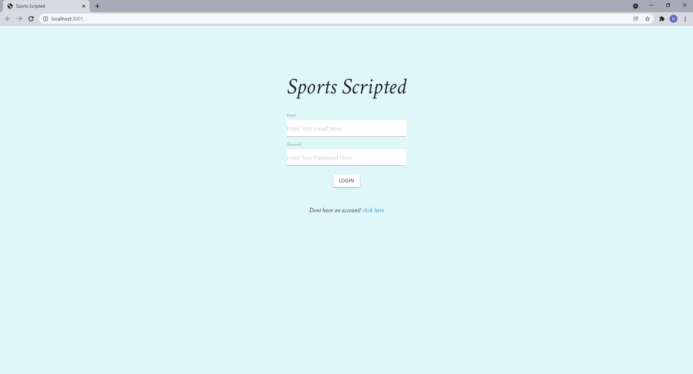
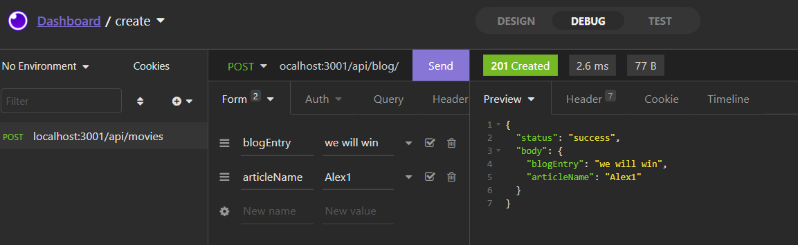
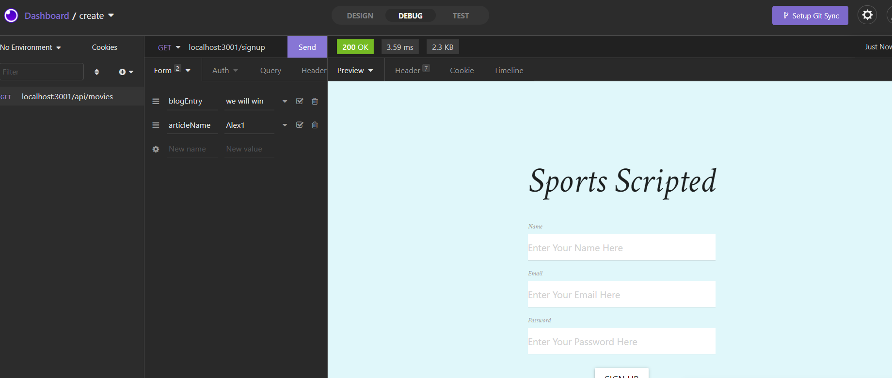
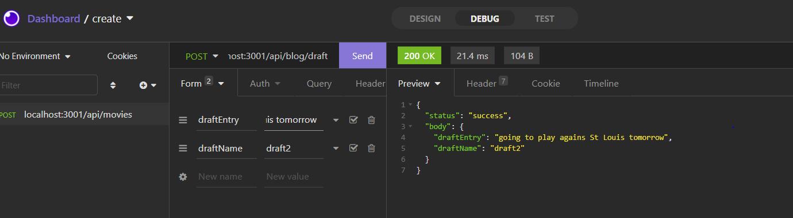
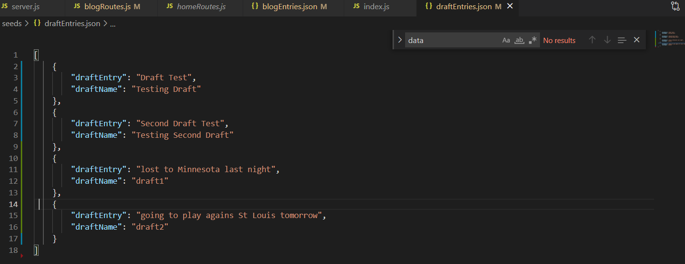
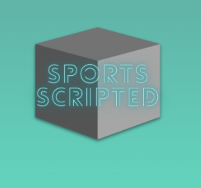

# Sports-Scripted

A simple to use webpage app that allows the user to take notes of games within different sports. This app is also a blog type application which allows the user to post blogs of sports events, based on the news displayed, stats from previous games, or even predictions of future performance. 

## User Story

    As big fans of sports teams in Dallas area, our team created a new app which allows to post new sports blog entries. This app meets most requirements of this project. We have four GET and two POST routes for retrieving and adding new data. Here is example of POST route: 

## Mock-up 

some examples of routes running within the application:

And here is example of GET route: 

And we can add new data to JSON file. When I click send button on Insomnia 

the data is added to JSON file: 

We used new technology called Canva to create an animated gif

## Links 

[Link to the Code Repository](https://github.com/DexterLGriffith/Sports-Scripted)

[Link to the deployed Heroku app](https://sports-scripted.herokuapp.com/)

## Credits 

Dexter Griffith

Alexander Umnov

Brandon Perez

Josh Hogan

## Libraries and frameworks 

[CSS Library: Materialize](https://materializecss.com/)

[Logo Design: Canva](https://www.canva.com/)

[Google Fonts - Crimson Text](https://fonts.googleapis.com/css2?family=Crimson+Text:ital@1&display=swap)

